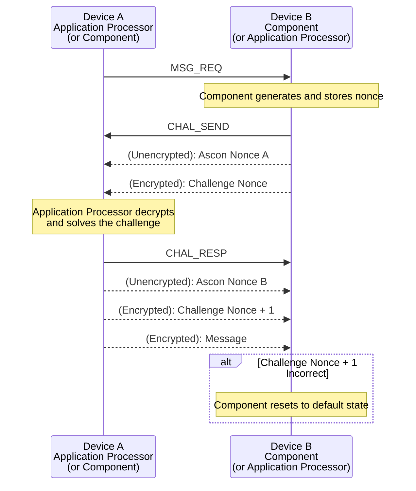

# HIDE Protocol Communication Layer
We implement an extra communication layer between the I2C layer and the application layer, which we refer to as the HIDE protocol. The HIDE protocol ensures that all messages maintain confidentiality, integrity, authenticity, and non-replayability. We require all messages sent between the AP and the Component to use HIDE.

HIDE effectively turns each message into a three-way challenge-response handshake. The sender first initiates a message request. The receiver will then send a random, encrypted challenge. The sender will then decrypt the challenge, solve it, and encrypt the challenge response to be sent along with the actual message.

We use the Authenticated Encryption (AE) cipher, Ascon, for our cryptographic scheme. We chose Ascon since it was selected in the NIST Lightweight Cryptography competition and has a masked software implementation that has been tested against various power analysis and hardware attacks.

All message information, including sender ID, receiver ID, nonce challenges/responses, and messages are encrypted with Ascon. The only exception is the HIDE message types (`MSG_REQ`, `CHAL_SEND`, `CHAL_RESP`) which are identified by their magic bytes.

Each direction of communication uses a different symmetric encryption key, meaning there are two encryption keys:

- $K_{AP,C}$ is the key for messages sent from the Application Processor to the Component.
- $K_{C,AP}$ is the key for messages sent from the Component to the AP.

Every AP and Components built from the same deployment will share the same keys.

Each message in the HIDE protocol contains a header, consisting of the HIDE message magic byte and an encrypted header. Within the encrypted header is the sender ID and the receiver ID. Messages are always checked by the receiver to ensure that the sender and receiver are correct. Components already have a 4-byte ID, so we define the AP's ID as three null bytes, followed by its I2C address byte.

### MSG_REQ
Description TODO.

| Name      | Offset | Size (bytes) | Content |
| --------- | ------ | ------------ | ------- |
| Magic     | `0x00` | 1            | `\x40`  |

### CHAL_SEND
Description TODO.

| Name      | Offset | Size (bytes) | Content |
| --------- | ------ | ------------ | ------- |
| Magic     | `0x00` | 1            | `\x41`  |
| Ascon Nonce | `0x01` | 16         | `\x?? * 16`  |
| Encrypted data | `0x01` | 32   | Challenge Nonce (16 bytes) + Ascon Tag (16 bytes)  |

> [!WARNING]
> Ascon Nonce should be randomly uniquely generated for all messages

### CHAL_RESP
Description TODO.

| Name      | Offset | Size (bytes) | Content |
| --------- | ------ | ------------ | ------- |
| Magic     | `0x00` | 1            | `\x42`  |
| Ascon Nonce | `0x01` | 16         | `\x?? * 16`  |
| Encrypted data | `0x11` | 112  | Challenge Nonce (16 bytes) + Message (always 80 bytes, zero padded) + Ascon Tag (16 bytes)  |

> [!WARNING]
> Ascon Nonce should be randomly uniquely generated for all messages

> [!NOTE]  
> Application messages can only be a maximum of 64 bytes.
