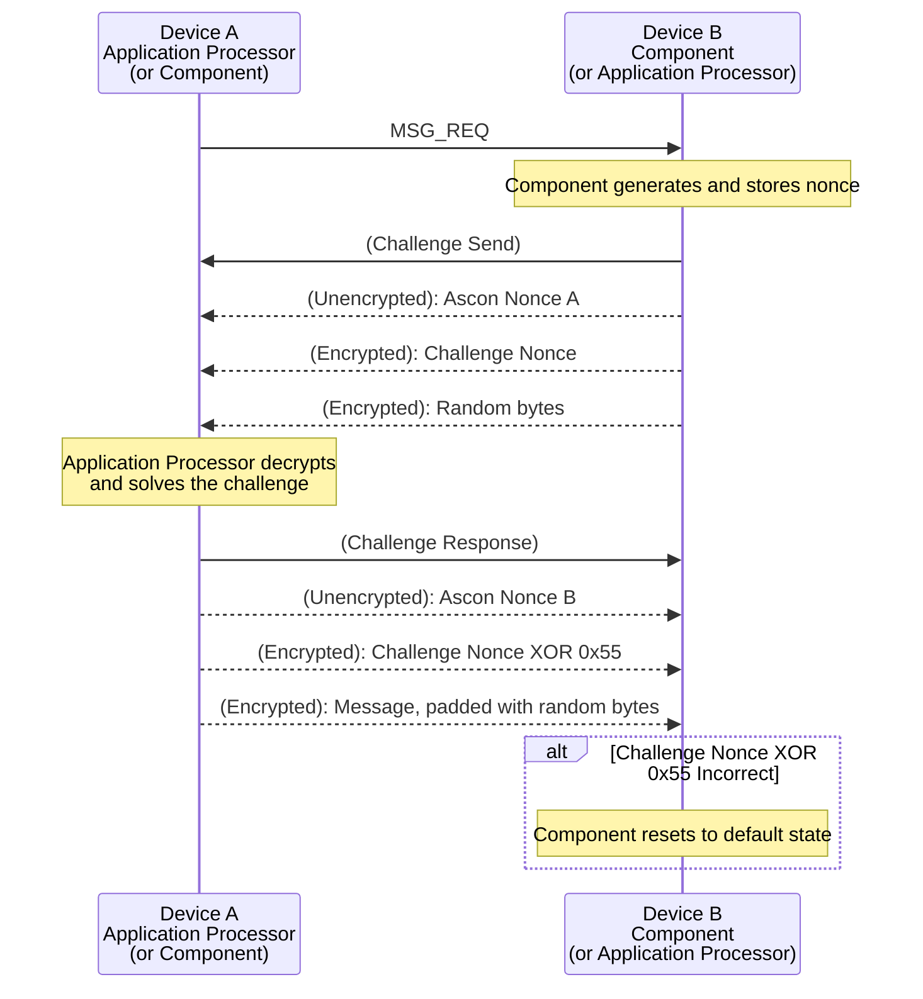

# HIDE Protocol Communication Layer
We implement an extra communication layer between the I2C layer and the application layer, which we refer to as the HIDE protocol. The HIDE protocol ensures that all messages maintain confidentiality, integrity, authenticity, and non-replayability. We require all messages sent between the AP and the Component to use HIDE.

HIDE effectively turns each message into a three-way challenge-response handshake. The sender first initiates a message request. The receiver will then send a random, encrypted challenge. The sender will then decrypt the challenge, solve it, and encrypt the challenge response to be sent along with the actual message. To solve the challenge nonce, the sender must perform a bitwise XOR of `0x55` with each byte in the challenge nonce.

We use the Authenticated Encryption (AE) cipher, Ascon, for our cryptographic scheme. We chose Ascon since it was selected in the NIST Lightweight Cryptography competition and has a masked software implementation that has been tested against various power analysis and hardware attacks.

## HIDE Protocol

We use Ascon's associated data feature to validate each message. The associated data is 8 bytes, with the first 4 bytes being the component ID, the fifth byte being the HIDE message magic byte, and the last three bytes being null bytes.

Each direction of communication uses a different symmetric encryption key, meaning there are two encryption keys:

- $K_{AP,C}$ is the key for messages sent from the Application Processor to the Component.
- $K_{C,AP}$ is the key for messages sent from the Component to the AP.

Every AP and Components built from the same deployment will share the same keys.

### MSG_REQ
Description TODO.

| Name      | Offset | Size (bytes) | Content |
| --------- | ------ | ------------ | ------- |
| Magic     | `0x00` | 1            | `\x40`  |

### CHAL_SEND
Description TODO.

| Name      | Offset | Size (bytes) | Content |
| --------- | ------ | ------------ | ------- |
| Ascon Nonce | `0x00` | 16         | `\x?? * 16`  |
| Encrypted data | `0x10` | 96   | Challenge Nonce (16 bytes) + Random bytes (80 bytes)  |

> [!WARNING]
> Ascon Nonce should be randomly uniquely generated for all messages

### CHAL_RESP
Description TODO.

| Name      | Offset | Size (bytes) | Content |
| --------- | ------ | ------------ | ------- |
| Ascon Nonce | `0x00` | 16         | `\x?? * 16`  |
| Encrypted data | `0x10` | 96   | Solved Challenge Nonce (16 bytes) + Message, padded with random bytes (80 bytes)  |

> [!WARNING]
> Ascon Nonce should be randomly uniquely generated for all messages

> [!NOTE]  
> Application messages can only be a maximum of 64 bytes. We provide up to 80 bytes for posterity.

\newpage