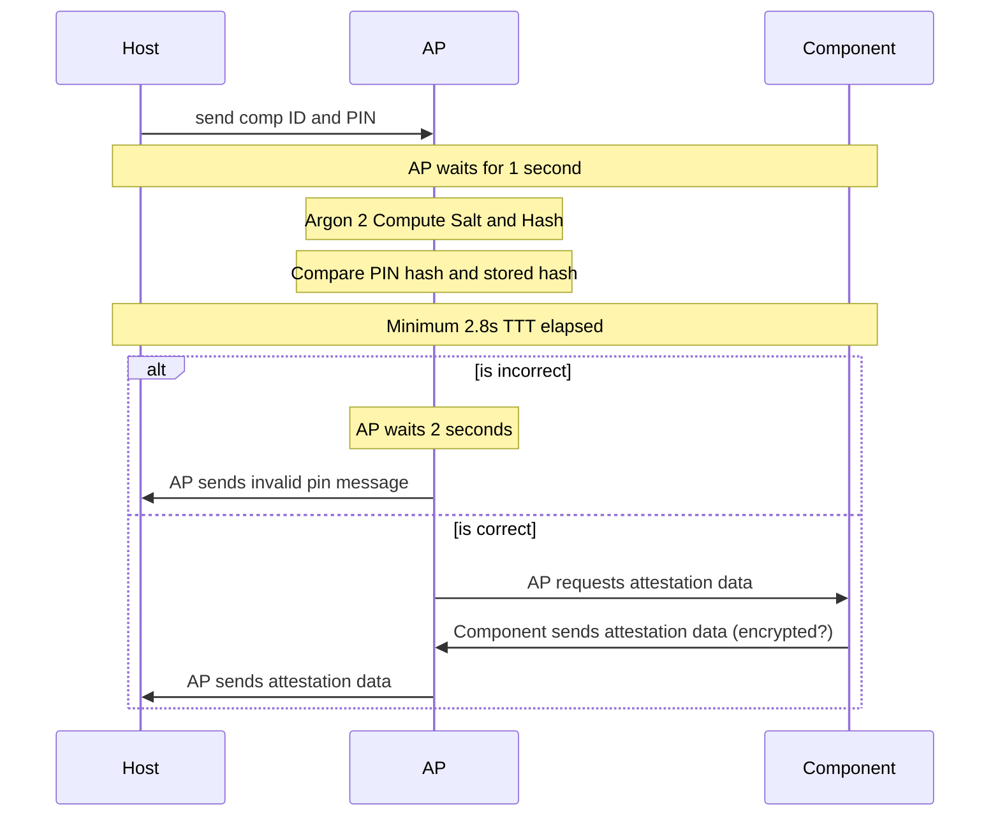

# MISC Protocol

Note: Please use Mermaid diagrams to visualize the protocol. Here is an example of what we expect in terms of documentation: https://github.com/sigpwny/2023-ectf-sigpwny/blob/main/docs/protocol.md

## List Components

## Attest Components

## Replace Components

## Boot Verification

## Post-Boot Communication

