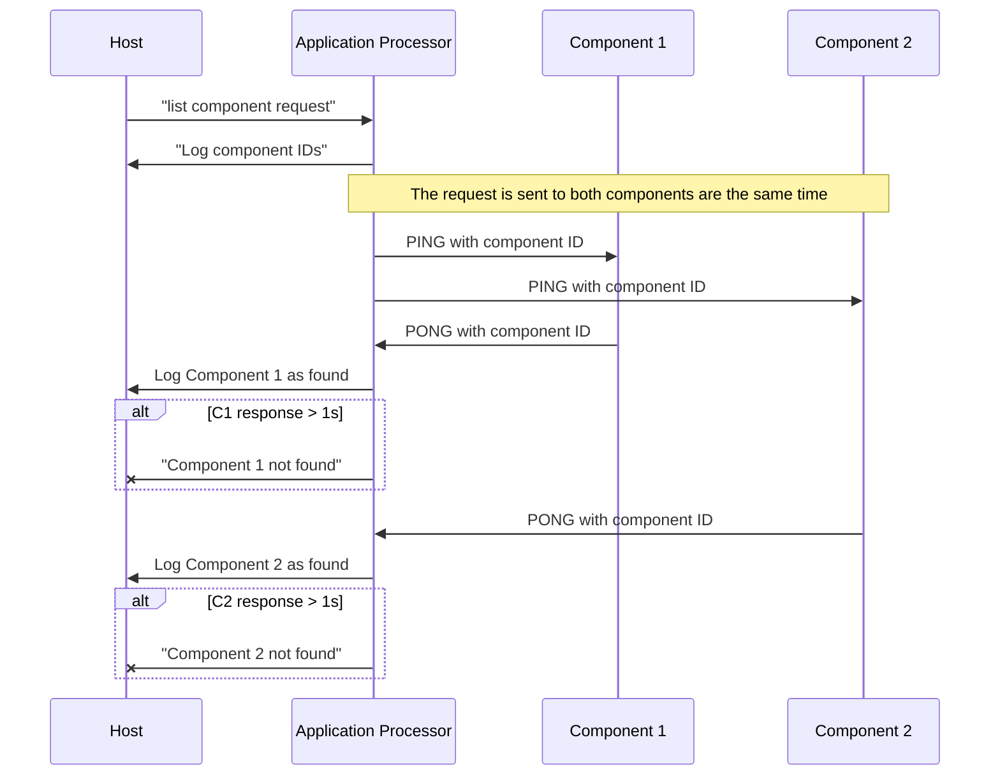
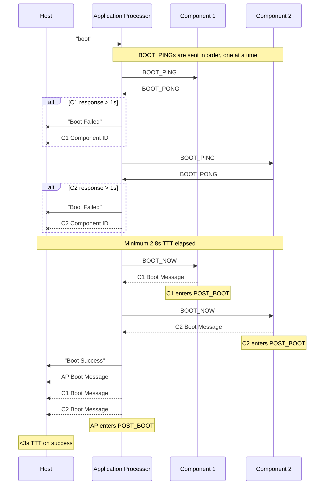

# MISC Protocol

Description TODO. All MISC messages are sent over the [HIDE protocol](./hide_protocol.md).

> [!NOTE]  
> "TTT" refers to "total transaction time" and is used to ensure timing functionality requirements are met.

## List Components
Description TODO.



### COMMAND_NAME
Description TODO.

| Name      | Offset | Size (bytes) | Content |
| --------- | ------ | ------------ | ------- |
| Magic     | `0x00` | 1            | `\x50`  |
| TODO      | TODO   | TODO         | TODO    |

## Attest Components
Description TODO.

```mermaid
```

### COMMAND_NAME
Description TODO.

| Name      | Offset | Size (bytes) | Content |
| --------- | ------ | ------------ | ------- |
| Magic     | `0x00` | 1            | `\x60`  |
| TODO      | TODO   | TODO         | TODO    |

## Replace Components
Description TODO.

```mermaid
sequenceDiagram
  participant H as Host
  participant AP as Application Processor
  H ->> AP: “Send Replacement Token Attempt, Old Component ID, and New Component ID”
  Note over H, AP: “AP waits for 3 seconds”
  Note over AP	: “Append Replacement Token Salt to received Replacement Token Attempt and compute Argon2 hash”
  Note over AP: “Compare Token Attempt hash to stored Correct Token hash”
  Note over H, AP: “Wait until 4.8 seconds total time elapsed since beginning of transaction”
  alt Correct Replacement Token
     Note over AP: “Updates Component ID list with new Component ID”
  end 

```

### COMMAND_NAME
Description TODO.

| Name      | Offset | Size (bytes) | Content |
| --------- | ------ | ------------ | ------- |
| Magic     | `0x00` | 1            | `\x70`  |
| TODO      | TODO   | TODO         | TODO    |

## Boot Verification
Description TODO.



### BOOT_PING
Description TODO.

| Name      | Offset | Size (bytes) | Content |
| --------- | ------ | ------------ | ------- |
| Magic     | `0x00` | 1            | `\x80`  |

### BOOT_PONG
Description TODO.

| Name      | Offset | Size (bytes) | Content |
| --------- | ------ | ------------ | ------- |
| Magic     | `0x00` | 1            | `\x81`  |

### BOOT_NOW
Description TODO.

| Name      | Offset | Size (bytes) | Content |
| --------- | ------ | ------------ | ------- |
| Magic     | `0x00` | 1            | `\x82`  |

## Post-Boot Communication
Description TODO.

