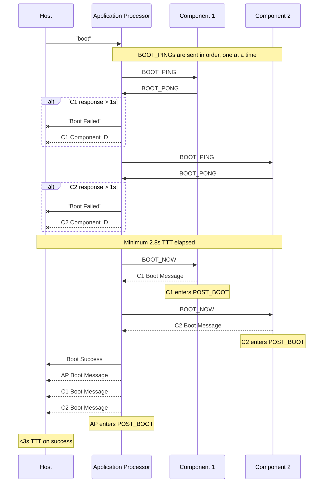

# MISC Protocol

Description TODO. All MISC messages are sent over the [HIDE protocol](./hide_protocol.md).

> [!NOTE]  
> "TTT" refers to "total transaction time" and is used to ensure timing functionality requirements are met.

## List Components
Description TODO.

## Attest Components
Description TODO.

## Replace Components
Description TODO.

## Boot Verification
Description TODO.

### BOOT_PING
Description TODO.

| Name      | Offset | Size (bytes) | Content |
| --------- | ------ | ------------ | ------- |
| Magic     | `0x00` | 1            | `\x80`  |
| TODO      | TODO   | TODO         | TODO    |

### BOOT_PONG
Description TODO.

| Name      | Offset | Size (bytes) | Content |
| --------- | ------ | ------------ | ------- |
| Magic     | `0x00` | 1            | `\x81`  |
| TODO      | TODO   | TODO         | TODO    |

### BOOT_NOW
Description TODO.

| Name      | Offset | Size (bytes) | Content |
| --------- | ------ | ------------ | ------- |
| Magic     | `0x00` | 1            | `\x82`  |
| TODO      | TODO   | TODO         | TODO    |

## Post-Boot Communication
Description TODO.

