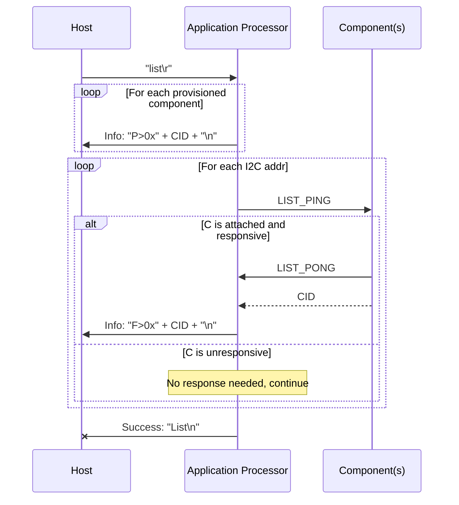
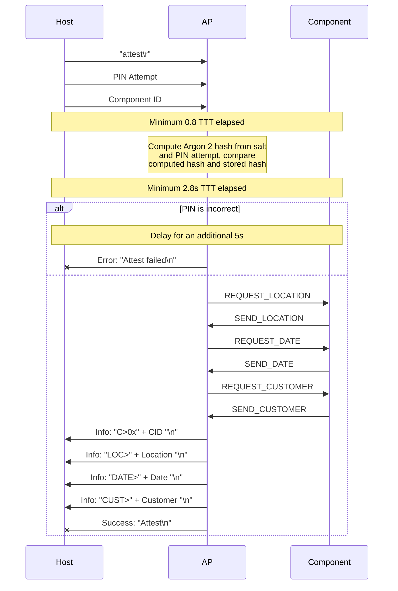
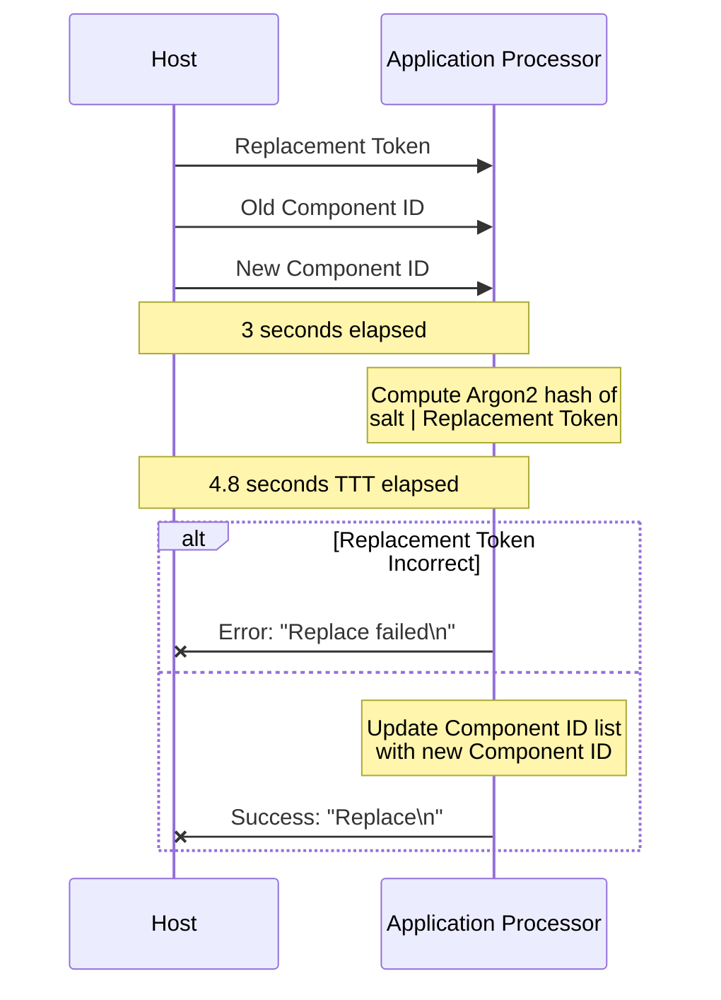
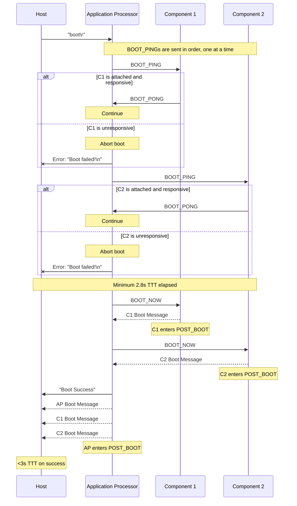

# MISC Protocol

Description TODO. All MISC messages are sent over the [HIDE protocol](./hide_protocol.md).

> [!NOTE]  
> "TTT" refers to "total transaction time" and is used to ensure timing functionality requirements are met.

## List Components
The host will ask the Application Processor to "list" its components.
The Application Processor, upon receiving the message from the host, will list its provisioned components.
It will then send a magic byte as a ping to every I2C address. For components that are present and responsive, they will send a magic byte pong as well as its component ID, which will prompt the Application Processor to send the component ID to the host.

### LIST_PING
This byte is sent to every I2C address. For present components, this indicates that the Application Processor is asking for its component ID.

| Name      | Offset | Size (bytes) | Content |
| --------- | ------ | ------------ | ------- |
| Magic     | `0x00` | 1            | `\x50`  |

### LIST_PONG
After being prompted by the Application Processor using LIST_PING, an active component will send a response byte and the component ID to the Application Processor.

| Name         | Offset      | Size (bytes) | Content            |
| ------------ | ----------- | ------------ | ------------------ |
| Magic        | `0x00`      | 1            | `\x51`             |
| Component ID | `0x01-0x05` | 4            | `\x??\x??\x??\x??` |

## Attest Components
Description TODO.

> [!NOTE]
> The PIN attempt and component ID need to be transmitted at the beginning in a way that the host tool can understand.

### REQUEST_LOCATION
Description TODO.

| Name      | Offset | Size (bytes) | Content |
| --------- | ------ | ------------ | ------- |
| Magic     | `0x00` | 1            | `\x60`  |

### SEND_LOCATION
Description TODO.

| Name             | Offset | Size (bytes) | Content            |
| ---------------- | ------ | ------------ | ------------------ |
| Magic            | `0x00` | 1            | `\x61`             |
| Location         | `0x01` | 64           | `\x?? * 64`        |

### REQUEST_DATE
Description TODO.

| Name      | Offset | Size (bytes) | Content |
| --------- | ------ | ------------ | ------- |
| Magic     | `0x00` | 1            | `\x62`  |

### SEND_DATE
Description TODO.

| Name             | Offset | Size (bytes) | Content            |
| ---------------- | ------ | ------------ | ------------------ |
| Magic            | `0x00` | 1            | `\x63`             |
| Date             | `0x01` | 64           | `\x?? * 64`        |

### REQUEST_CUSTOMER
Description TODO.

| Name      | Offset | Size (bytes) | Content |
| --------- | ------ | ------------ | ------- |
| Magic     | `0x00` | 1            | `\x64`  |

### SEND_CUSTOMER
Description TODO.

| Name             | Offset | Size (bytes) | Content            |
| ---------------- | ------ | ------------ | ------------------ |
| Magic            | `0x00` | 1            | `\x65`             |
| Customer         | `0x01` | 64           | `\x?? * 64`        |

## Replace Components
Description TODO.

## Boot Verification
Description TODO.

### BOOT_PING
Description TODO.

| Name      | Offset | Size (bytes) | Content |
| --------- | ------ | ------------ | ------- |
| Magic     | `0x00` | 1            | `\x80`  |

### BOOT_PONG
Description TODO.

| Name      | Offset | Size (bytes) | Content |
| --------- | ------ | ------------ | ------- |
| Magic     | `0x00` | 1            | `\x81`  |

### BOOT_NOW
Description TODO.

| Name      | Offset | Size (bytes) | Content |
| --------- | ------ | ------------ | ------- |
| Magic     | `0x00` | 1            | `\x82`  |

## Post-Boot Communication
Description TODO.

